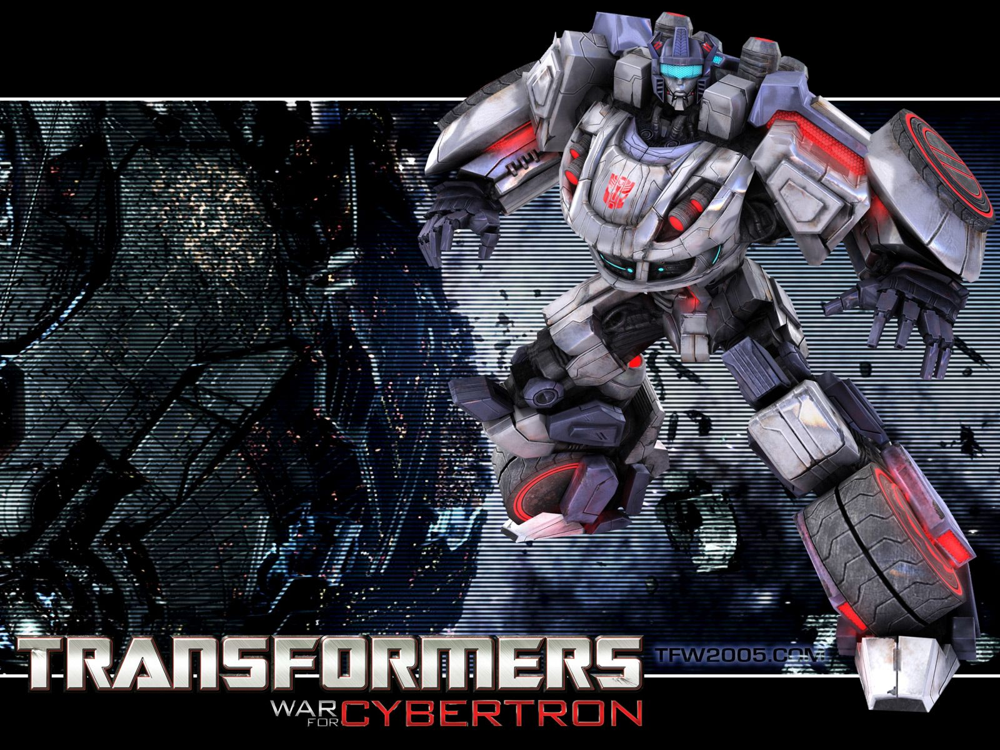

# Kazz

<div align="center">

<div align="center">
    
</div>


**Jazz** — lightweight, private service assistant for anyone

</div>

**Jazz** is an AI-powered CLI tool designed to assist with anything from everyday tasks to complex projects efficiently, without leaving the terminal.

Jazz was built a fully local agentic system using **[Ollama](https://ollama.com/download)**, but it also works seamlessly with:

-   OpenAI
-   Anthropic
-   Google GenAI
-   Cerebras
-   _(more integrations on the way!)_

This tool is best suited for scenarios where privacy is paramount and agentic capabilities are needed in the workflow.

## Key Features

### Default Chat Interface

A general-purpose agent that can:

-   Read, write, modify, and delete files and directories.
-   Access the internet.
-   Execute commands and code.

    **_Note:_** Tools always ask for your permission before executing.

### RAG

Jazz can take your files, embed them into its knowledge base, and use them to respond to your prompts with a high level of accuracy.

Currently, Jazz's embedding functions can use:

-   Hugging Face models (locally)
-   Ollama Embedding models (locally)
-   NLP Cloud (hosted)
-   OpenAI (hosted)
-   _More on the way..._

**RAG Tutorial:**

1. Setup the `config.json` as shown below with the appropriate embedding settings.

2. Provide the path to the file or folder whose contents should be embedded. As an alternative, you can launch Jazz from that directory.

3. Use `/embed <path> <collection_name>` or `/embed . <collection_name>` if already at the correct path.

4. Start the RAG session with `/start_rag`

5. End the RAG session with `/stop_rag`

**Note** that Jazz will not use any external data to answer your prompts during RAG sessions unless explicitly given permission to.

**Additional commands:**

-   Edit indexed collections with `/index <collection_name>` and `/unindex <collection_name>.` **_Note:_** newly created collections are already indexed.

-   View all collections with `/list`

-   Reset the database with `/purge` or delete a specific collection with `/delete <collection_name>`

### Full Coding Project Generation Workflow (Preview version)

-   Use the `--create-project` flag or the `/project` command in the default chat interface.

**Complete workflow:**

-   Asks for your project idea.
-   Runs the **_Brainstormer Agent_** to create the context space and full project specification for the **_Codegen Agent_** (in `.md` format).
-   Optionally lets you provide more context by chatting interactively with the **_Brainstormer Agent_**.
-   Runs the **_Codegen Agent_** using the generated `.md` files.
-   Opens an interactive chat with the **_Codegen Agent_** to refine or extend the project.

This workflow is still in its early stages.

## Setup

You have 2 options: Via Docker or locally on your machine.

### **1. Docker**

Create a `.env` file (or copy `.env.example`) in any location

```
# Inference providers (only include those you need)

OPENAI_API_KEY=...
ANTHROPIC_API_KEY=...
GOOGLE_GEN_AI_API_KEY=...
CEREBRAS_API_KEY=...

# Embedding providers APIs (As needed. Only add those you need.)

NLP_CLOUD_API_KEY=...

# Google Search API (if omitted, online search tools will be limited)

GOOGLE_SEARCH_API_KEY=...
SEARCH_ENGINE_ID=...
```

> See [steps](#programmable-search-engine-steps) for the Google Search API part.

Open a terminal in that directory and type

```bash
# Pull the  image:
docker pull yassw0rks/ally:latest


# Start the container for the first time
docker run -it --env-file .env --name ally yassw0rks/ally:latest


# You could also assign a volume:
# Replace <YOUR_LOCAL_DIR> with a path on your machine.
# Note that Docker must have permission to <YOUR_LOCAL_DIR>. It can be configured from the settings.
docker run -it \
  --env-file .env \
  -v <YOUR_LOCAL_DIR>:/data \
  --name ally \
  yassw0rks/ally:latest
```

Next time you want to jump back in

```bash
# Check if container already running
docker ps

# If it is running
docker exec -it ally /bin/bash

# If it's stopped
docker start -ai ally
```

> Edit the `config.json` file (see below) inside `/app` as needed. Nano is included in the image for your convenience.

> **Note** this image does **not** contain Ollama. But it can easily be setup once inside the container.

### **2. Local**

### Prerequesites:

-   [Python](https://www.python.org/)
-   [Git](https://git-scm.com/downloads) (or download the source code from this repo)
-   [Ollama](https://ollama.com/download) (optional)

### 1. Clone the Repo

In your chosen installation folder, open a terminal window and run:

```bash
git clone https://github.com/YassWorks/Ally.git
```

### 2. Configure `config.json` in `/Ally`

This file (located at `Ally/`) controls Ally's main settings and integrations.

**Example configuration:**

```json
{
    "provider": "openai",
    "provider_per_model": {
        "general": "ollama",
        "code_gen": "anthropic",
        "brainstormer": null, // autofilled with 'openai'
        "web_searcher": null // autofilled with 'openai'
    },

    "model": "gpt-4o",
    "models": {
        "general": "gpt-oss:20b",
        "code_gen": "claude-sonnet-3.5",
        "brainstormer": null, // autofilled with 'gpt-4o'
        "web_searcher": null // autofilled with 'gpt-4o'
    },

    "temperatures": {
        "general": 0.7,
        "code_gen": 0,
        "brainstormer": 1,
        "web_searcher": 0
    },
    "system_prompts": {
        // (recommended) leave as-is to use Ally's defaults
        "general": null,
        "code_gen": null,
        "brainstormer": null,
        "web_searcher": null
    },

    "embedding_provider": null, // example: "hf" or "ollama"
    "embedding_model": null, // example: "sentence-transformers/all-MiniLM-L6-v2" or "all-minilm"

    "scraping_method": "simple" // or "docling"
}
```

> **Note**: Docling is _heavy_. And requires lots of dependencies. It's recommended to go with the local install if you wish to use Docling. 

> **Alternatively**, you could setup a volume (for the parsing and the embedding models) between your machine and the container so that models are persisted across sessions. See below for information where the models are stored inside the container by default.

### 3. Configure `.env` in `/Ally`

This file stores your API keys.

```
# Inference providers (only include those you need)

OPENAI_API_KEY=...
ANTHROPIC_API_KEY=...
GOOGLE_GEN_AI_API_KEY=...
CEREBRAS_API_KEY=...

# Embedding providers APIs (As needed. Only add those you need.)

NLP_CLOUD_API_KEY=...

# Google Search API (if omitted, online search tools will be limited)

GOOGLE_SEARCH_API_KEY=...
SEARCH_ENGINE_ID=...
```

#### Programmable search engine steps:

1. Set up a Google [Programmable Search Engine](https://developers.google.com/custom-search/v1/overview)
2. Copy the contents above (or from `.env.example`) into `.env`.
3. Fill in your API keys and IDs.

### 4. Run setup executable

Depending on your OS choose either `setup.cmd` (Windows) or `setup.sh` (Linux/Mac)

**_Note:_** Ally creates its own virtual environment to keep dependencies isolated and automatically adds itself to your PATH.

Now you’re ready to run Ally from anywhere in the terminal using `ally`.

Use `ally -h` for more help.

## Technical notes

1. Edit the following environment variable if needed:

| Environment Variable        | Purpose                                                         |
| --------------------------- | --------------------------------------------------------------- |
| `ALLY_HISTORY_DIR`          | Controls where Ally stores its history.                         |
| `ALLY_DATABASE_DIR`         | Controls where Ally stores its database.                        |
| `ALLY_EMBEDDING_MODELS_DIR` | Controls where Ally stores its embedding models (Hugging Face). |
| `ALLY_PARSING_MODELS_DIR`   | Controls where Ally stores its parsing models used by Docling.  |

Defaults are:

```
Windows:
%LOCALAPPDATA%\Ally\...

Linux & MacOS:
~/.local/share/Ally/...
```

2. RAG-related tools used by Ally are large in size and are therefore downloaded only after RAG settings are enabled in the config.json file. As a result, Ally will perform additional downloads the next time it is launched following these configuration changes.

3. To save a chat, use /id to view the conversation ID. The next time you open Ally, continue the conversation by using the -i flag followed by the ID. You can do the same inside the CLI, just do `/id <your_id>`

4. Embedding and scraping files that require OCR (such as PDFs and DOCX) currently use a CPU-only PyTorch installation. You can modify the configuration to utilize a GPU if desired, though this is typically only necessary for processing very large files.

## License

Apache-2.0

---

Issues are always welcome 💌

Contact me via email to discuss contributions or collaborations on other projects if you liked my work!
